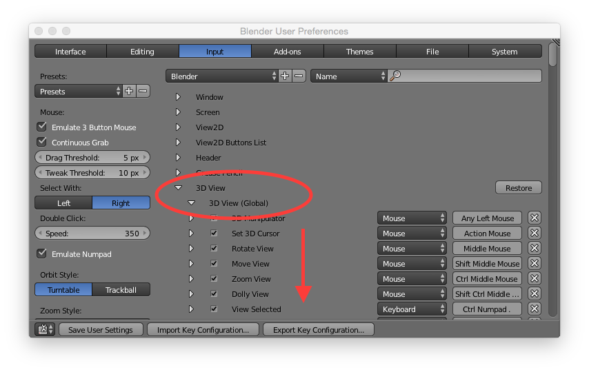
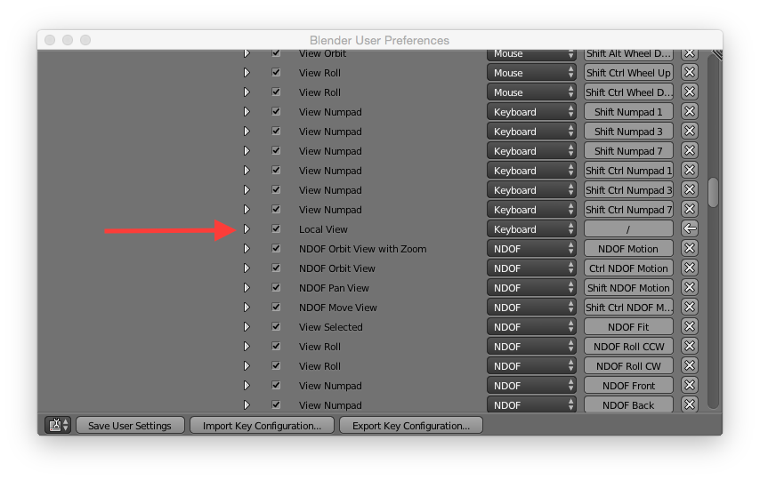
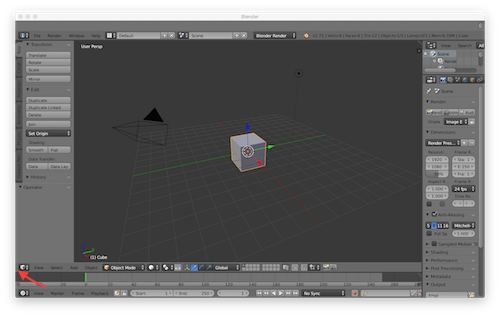
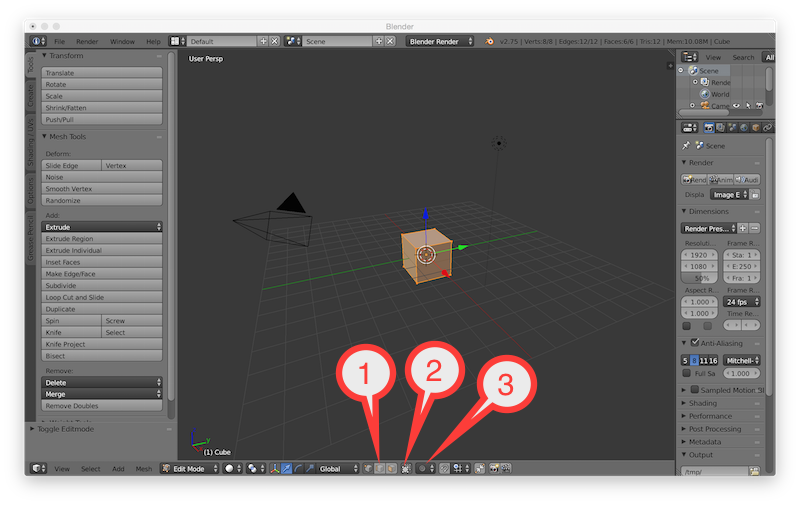
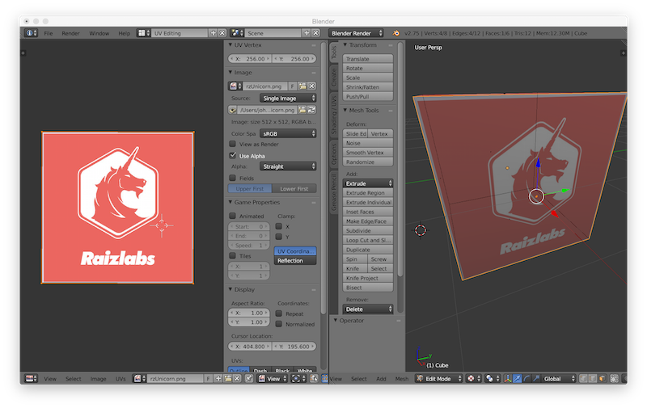

Blender Workshop
===
Raizlabs 9/28/15

**The following document covers Blender 2.75a running on OSX**

#Setup

###Keyboard settings
The following settings changes are to optimize the use of a laptop keybard and track pad. While Blender has good keyboard shortcuts that make use of 3 button mouse as well as a keyboard with a numeric pad, the following adjusments should make working with a laptop at least tolerable.

####User preferences location
Go to `file -> user preferences` or the hot key is `command-comma`

####Emulate Numpad & 3 button mouse
Under the `input` tab in user preferences, select `emulate num pad`. This will make your laptop keyboard's numeric keys function as an extended keyboard's numeric keys. You also want to check the box marked `emulate 3 button mouse`. This will make it so that if you hold `alt` and `left-click` this will simulate the press of the third button.

####Interface settings adjustments
Under the `interface` tab in user preferences, select `Zoom to Mouse Position` and `Rotate Around Selection`. These settings will give you more controller over what happens when you zoom or rotate. 

####Map the '/' key to Local View
The '/' on the numeric keypad allows you to focus on a single object exclusively, removing all other objects from sight and turning off any lighting effects. This local view is fairly useful even if you're only working with one object as its nice to easily disable the lighting effects and bring your object to front and center. 

Under the `interface` tab in user preferences, uncollapse the `3D View` arrow, and then uncollapse `3D View (Global)`. You'll then have to scroll down a ways until you find `Local View`. You'll see to the right it says `Numpad /`. Select the `Numpad /` and it will then say `press any key` and then press the `/` key on your keyboard. 

####Save User Settings
Now select `Save User Settings` in the bottom left of the User Preferences window to save your settings.

#Interface windows

Blender's UI consists of windows which are highly customizable. You create and save your own custom window layouts for different tasks. Right now we can git some more screen space by removing the timeline view at the bottom of the screen. The timeline view is used for animations and we won't have time to cover that today. 

To remove the timeline window, move your cursor to the bottom left of the screen until it is to the bottom left of the mini 3D cube and your cursor turns into a cross (you'll see some tiny beveled edges to the corner of the window here). Then click and drag downwards to remove the timeline window.

Then save the startup file by pressing `control` `u` and selecting OK.
 

#Interface basics

###1. Object vs. Edit Mode
 Press `tab` to switch between object and edit mode. Many actions that you take in blender will differ depending upon which mode that you are in. In general, you will use object mode to add or delete objects. Whenever you want to manipulate an object, you should in general be in edit mode. 
 
###2. Layer buttons (or why did my stuff disappear?)
Blender also allows you to place objects in different layers. You can display each of these layers by clicking on them. You can also display more then one layer simultaneously by holding `shift` as you select layers.

###Views
The object can be viewed from different directions by using your number keys (if you are using a laptop and have not turned on the `emulate numpad` option as described in the setup section, this won't work). Here are the more useful ones: 	

- Front : `1` 
- Back: `control-1`
- Right: `3`
- Left: `control-3`
- Top: `7`
- Bottom: `control-7`
- Orthographic vs. Perspective: `5`
    Pressing `5` will turn the perspective effect on or off. Turning off the perspective effect can be useful at times for more precise editing.  

###Object Selection
If you are in object mode, right clicking (two finger click on the track pad) will select the object. You can tell an object is selected because an orange border will be drawn around it. Once you have an object selected, you can enter edit mode (`tab`). Once you are in edit mode, selection becomes much more interesting and will be described as part of 'Basic Editing' below.

###Moving your view
Hold down `shift` and two finger drag to move your view of the object up, down, left or right (with a mouse you can hold down your mouse whell and drag).

###Rotating and zooming
You can rotate your view by right clicking and dragging (two finger click and drag). To zoom, perform a pinch movement on the trackpad (or scroll wheel on a mouse). 

#Basic Editing

Now with the cube selected, enter edit mode. You will see the interface change a bit: 

###1. Points, Lines, and Faces
You can choose to select either points, lines or faces of an object. When you first enter edit mode, all of your cube will be selected. Press `a` to deselect every thing. 

To select a single element, two-finger tap on it (right click). To select multiple elements, hold down shift and two-finger tap. 

### Selecting All or None
You will be using the `a` key a lot to either select all elements of your object or to clear your selection. 

Also if you are zooming and rotating wish to rotate around or zoom the whole object rather then your selection, you can select all of the elements by hitting `a` before zooming or rotating your view.

### Move

Once you have an element selected, you can move it using the `g` key (grab). Note how the impact of moving the object changes depending on the type of element that you have selected.

### Rotate

Pressing `r` will rotate the element that you have selected. 

### Scale

Pressing `s` will scale the element that you have selected. Note if you only have one point selected, then scale will not do anything.

### Limiting editing: X, Y, Z
Once you have initiated a move, scale or rotate command (`g, s, r`) you can then limit your editing along an axis by pressing the letter of that axis (`x`, `y`, or `z`. This can be useful because altering the shape of things in 3D space can be difficult to do precisely. You can also hold down the shift key and select additional axis to transform your selection along more then one axis. 

### Specifying amounts while editing
You can also specify an amount to transform you selection. For example:
- select a face
- `g` to move that face
- `x` to move it only along the x axis
- type 5 to move it five units along the x axis

### 2. Limit selection to visible
If this little button is activated, then you will not be able to 'select through' your object. When you deactivate this button, you will notice that you can now see through your object and you can also then select elements of that object even if they are obscured by other elements.

### Box selection
Press `b` then click and drag to use a rectangle method of selection.

### Brush selection
Press `c` to use a brush style of selection. Your cursor will turn into a circle, and you can then paint select elements that you want by clicking and dragging. You have to press `return` or `esc` once you have entered this mode to exit it. 

### Delete
You can delete any of your selected elements by pressing the `x` key.

### Extrude
So far, we've only manipulated existing features of an object. Extruding is a form of editing which is often used when building out an object. To extrude, select a face of your cube, hit `e`. Blender will automatically try and constrain the axis of your extrusion. You can either then move your mouse to adjust the extrusion amount, or you can type a number to extrude a certain amount.

#Advanced Editing and Selection

We'll try working with a different shape for the next section. Exit out of edit mode by pressing `tab`, then hit `x` to delect your cube (unless you've done something that you are really proud of, then save your blender file first and then select `new` from the file menu).

The red and white circle represents your 3D cursor, and it may have moved away from the center of the grid while editing the previous object. Since we want the new object we are going to create to be at the center of our view, we need to put this cursor back into the center. To do this, type `shift-s` and then select `cursor to center`.

To add a new object, type `shift-a` and select `add cylinder`. You should see a cylinder appear on your screen in the center. Also, if you look to the bottom right you will see a `cylinder` drop down in the left pane. If you uncollapse this, you can also change various aspects of the object. This is a pretty common menu that pops up when creating a base object, but once you do anything with that object these options will disappear. 

Now with the cylinder select, go back into editing mode. 

###Loop select
Say you wanted to select all of the faces of the cylinder without selecting the top or the bottom. You can do this with loop select, which tries to select all elements that encircle your object.
- Deselect all elements by pressing `a`
- Make sure face selection is on
- hold down `option` and right click a face on the side of the cylinder.

You can also try just selecting the top circle of the cylinder in this manner by switching to line selections. 

###Loop cut
Often you will want to slice your object to make it more modifiable. A loop cut will attempt to create a new set of elements in a circle around your selection. Say for example you wanted to squeeze the center of your cylinder so it looks more like an hourglass. 

-Type `control-r` and move your cursor around the object and watch blender try and guess what your are trying to do. 
-Once you have a dividing line across the center of your cylinder, click to lock that edit in. 
-You can also elect to make multiple cuts by typing in the number of cuts that you would like (if you have a mouse, you can use the scroll wheel to increase or decrease the number of cuts). Once you enter a number, click to set that number.  
-You can slide the cut up or down the cylinder by dragging (once you start sliding, you won't be able to specify the number of cuts).
-click to make the cuts.

If you mess this up just hit escape before making the cuts, or hit `command-z` to undo any cuts 

###Subdivide
You'll notice that the amount of detail in your mesh is determined by the number of elements it has. To keep the objects shape but add more elements, you can subdivide the object by hitting the `w` key, then selecting `subdivide`at the top of the drop down. Note that the subdivide command will only effect the elements that you have selected. 

###2. Proportional Editing 

If you enable this button, your transformations will proportionally spread around your selection:
- enable proportional selection
- select a loop of your cylinder (`option` two finger click)
- scale the selection `s`
- disable proportional selection (because you'll often forget to)

###Contiguous select
This is useful it you are working on a complex object that has different parts to it. If you type `control-l` once you have selected an element of the object, blender will select all elements of that object that are linked to each other. In the case of the cylinder, this will be the same as select all because all of the elements are contiguous. 

Try making a loop cut out of the cylinder and then using `control-l` to select different parts of it.

#Modifiers

Modifiers change the appearance of the object without altering the object's data itself until you apply the modifier. These can be very useful for making complex objects simple to manipulate. Modifers work in `object` mode because the are applied to objects as a whole and not individual elements of an object. 

###Subsurf

-Make sure your in object mode with an object selected
-In the right panel (you may need to drag it out to the left) select the little wrench amongst the icons.
-Select `add modifier`
-Select `subdivision surface`

You can adjust the number of subdivisions by changing the `view` property. Go to editing mode and notice how the objects appearance differs from the elements that you can select. Place with editing the object a bit, then go back to object mode (`tab`), hit `apply` then go back to edit mode (`tab`). This will apply the modifier and turn the modifications into object elements. 

###X/Y Mirror

Many objects that you edit will be generally symmetrical along one axis (like faces, vehicles, etc). This modifier helps with that process. To try this out, go back to the basic cube (file -> new), and then subdivide the cube once in edit mode. Back in object mode, add the modifier 'Mirror'. Note how the cube now has a mirrored side which does not really exist until the modifier is applied. 

#UV Editing

###What's a UV?
W, X, Y, and Z were already taken. UV refers to two dimensional coordinates which map an image (commonly referred to as a texture) to an object. Each point in an object will have an associated UV coordinate. 

###The interface

Change the screen layout from Default to UVEditing. 

